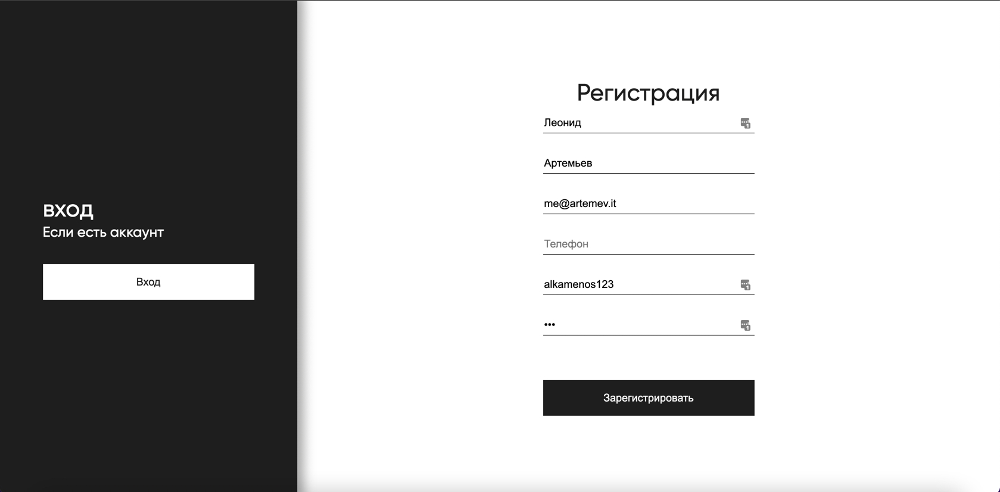

* Запуск проекта - ```npm run start```
* Сборка - ```npm build```
* Dev Сборка - ```npm run dev```
* Figma - https://www.figma.com/file/GkaUIeXPCHXLgAyPPBhk5A/Chat-Copy
* Demo - https://adoring-lumiere-f783d7.netlify.app/
* Heroku - https://fierce-sierra-73313.herokuapp.com/

Pull request - https://github.com/Alkamenos/middle.messenger.praktikum.yandex/pull/5


